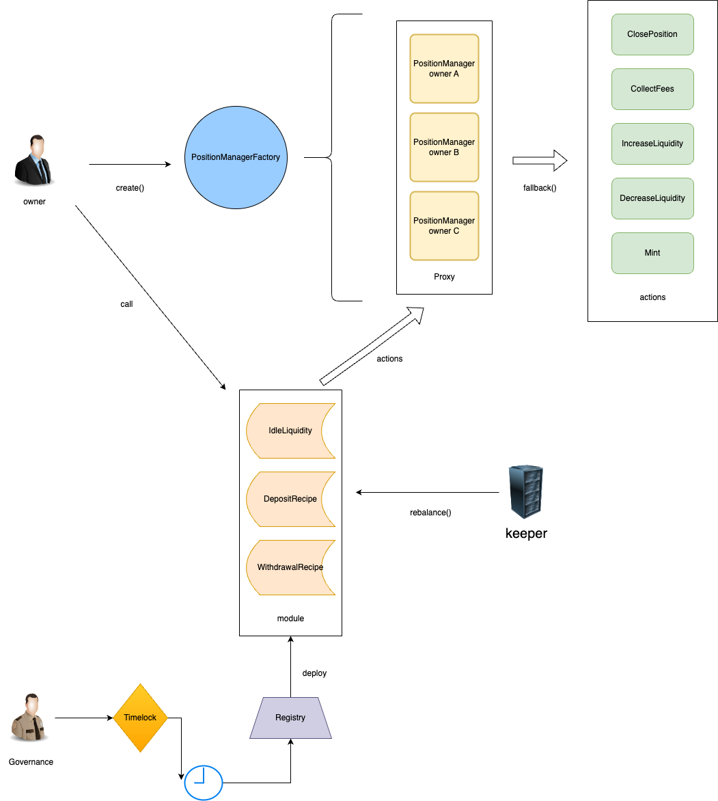

# Uniswap V3 Smart Vault

# Table of contents
- [Flowchart](#flowchart)
- [Project Folder Architecture](#project-folder-architecture)

## Flowchart

## Project Folder Architecture

---

    |-- Project
        |-- contracts   --this is where the source files for your contracts should be.
            |-- actions
                |-- ClosePosition.sol
                |-- IncreaseLiquidity.sol
                |-- Mint.sol
                |-- RepayRebalanceFee.sol
                |-- ReturnProfit.sol
                |-- ShareProfit.sol
                |-- SingleTokenIncreaseLiquidity.sol
                |-- SwapToPositionRatio.sol
                |-- ZapIn.sol
            |-- libraries
                |-- ERC20Helper.sol
                |-- MathHelper.sol
                |-- SafeInt24Math.sol
                |-- SafeInt56Math.sol
                |-- SwapHelper.sol
                |-- UniswapHelper.sol
                |-- UniswapQuoter.sol
            |-- modules
                |-- BaseModule.sol
                |-- IdleLiquidityModule.sol
            |-- recipes
                |-- DepositRecipes.sol
                |-- WithdrawRecipes.sol
            |-- interfaces
                |-- actions
                    |-- IClosePosition.sol
                    |-- IIncreaseLiquidity.sol
                    |-- IMint.sol
                    |-- IRepayRebalanceFee.sol
                    |-- IReturnProfit.sol
                    |-- IShareProfit.sol
                    |-- ISingleTokenIncreaseLiquidity.sol
                    |-- ISwapToPositionRatio.sol
                    |-- IZapIn.sol
                |-- modules
                    |-- IIdleLiquidityModule.sol
                |-- recipes
                    |-- IDepositRecipes.sol
                    |-- IWithdrawRecipes.sol
                |-- IDiamondCut.sol
                |-- IERC20Extended.sol
                |-- IPositionManager.sol
                |-- IPositionManagerFactory.sol
                |-- IRegistry.sol
                |-- IScaledBalanceToken.sol
                |-- IUniswapAddressHolder.sol
                |-- IUniswapCalculator.sol
                |-- IStrategyProviderWallet.sol
                |-- IStrategyProviderWalletFactory.sol
                |-- IMulticall.sol
                |-- IWETH9.sol
            |-- base
                |-- Multicall.sol
            |-- test
                ...
            |-- utils
                |-- UniswapAddressHolder.sol
                |-- UniswapCalculator.sol
            |-- Storage.sol
            |-- DiamondCutFacet.sol
            |-- PositionManager.sol
            |-- PositionManagerFactory.sol
            |-- StrategyProviderWallet.sol
            |-- StrategyProviderWalletFactory.sol
            |-- Registry.sol
            |-- Timelock.sol
        |-- deploy
            ... 
        |-- test --this is where your tests should go.
        |-- scripts --this is where simple automation scripts go.

---

# To be continue...